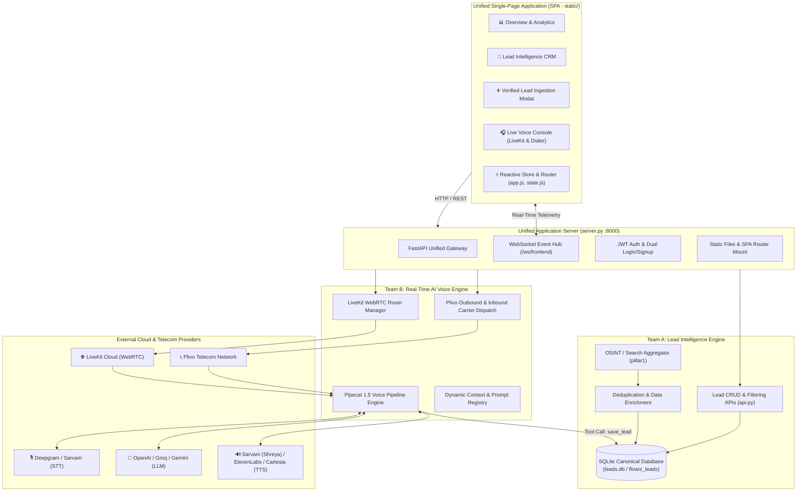
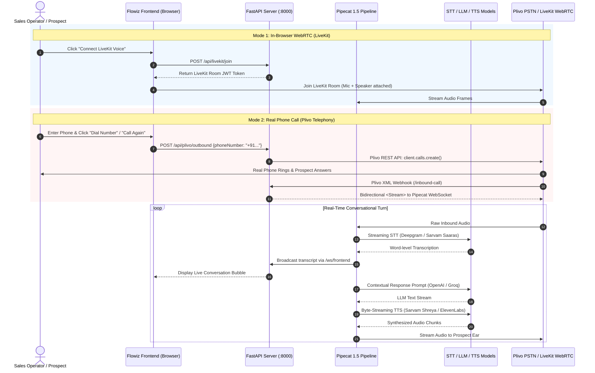

# 🚀 Flowiz — Cybernauts Integrated Platform

<p align="center">
  
  <br/>
  <b>Autonomous B2B Lead Intelligence, Discovery & Real-Time Conversational AI Voice Platform</b>
</p>

<p align="center">
  <a href="https://python.org"></a>
  <a href="https://fastapi.tiangolo.com"></a>
  <a href="https://livekit.io"></a>
  <a href="https://www.plivo.com"></a>
  <a href="https://pipecat.ai"></a>
  <a href="https://sqlite.org"></a>
</p>

---

## 📖 1. Overview

**Flowiz (Cybernauts Integrated)** is an enterprise-grade platform unifying **Automated B2B Lead Intelligence & Discovery** (Team A) with an ultra-low latency **Conversational Voice AI Agent & Telephony Engine** (Team B) into a cohesive, single-port full-stack platform.

The system empowers sales and revenue teams to:
1. **Discover & Qualify B2B Leads:** Crawl, clean, and enrich multi-source OSINT data (Clutch, GoodFirms, Google/DuckDuckGo, LinkedIn) into structured lead dossiers.
2. **Execute Autonomous AI Voice Calls:** Run natural, sub-500ms voice qualification calls either directly inside the browser (**LiveKit WebRTC**) or via real PSTN carrier phone networks (**Plivo Telephony**).
3. **Manage Pipeline CRM:** Track qualification status, stage transitions, interaction timelines, and 1-click redialing.
4. **Monitor Real-Time Audio & Transcripts:** Stream live conversation events, speech recognition transcripts, and sentiment analysis to the dashboard via WebSockets.

---

## 🏛️ 2. System Architecture



---

## 🔄 3. Dual-Channel Call Flow



---

## ✨ 4. Key Features

### 🏢 1. Lead Intelligence & CRM (Team A)
- **Multi-Source OSINT Lead Discovery:** Automated scraping and enrichment from industry directories and search engines.
- **Dossier & Company Profiling:** Tracks company name, website, phone, email, address, rating, review count, and employee size.
- **Manual Verified Lead Ingestion:** Modern modal UI allowing operators to manually add verified leads directly into `leads.db`.
- **Pipeline Kanban & Analytics:** Visual funnel tracking stages: `New Lead`, `Contacted`, `Qualified`, `In Negotiation`, `Closed Won`, and `Unqualified`.

### 🎙️ 2. Autonomous Conversational AI Voice Agent (Team B)
- **Ultra-Low Latency Pipecat 1.5 Runtime:** Sub-second latency turn-taking architecture with dynamic speech interruption.
- **Dual Calling Transports:**
  - **LiveKit WebRTC:** Instant browser-to-agent voice testing without telephony credits.
  - **Plivo PSTN Telephony:** Direct outbound dialing to mobile/landline numbers in E.164 format.
- **1-Click Redial ("Call Again"):** Instantly redials any prospect from call history or lead cards with pre-filled context.
- **Multilingual Support:** English, Hindi, and natural Hinglish powered by Sarvam AI (`Saaras` STT and `Bulbul` Shreya TTS).
- **Filler Suppression & Event Bus:** Dynamic event cancellations preventing audio collisions when user interrupts the AI.

### 💻 3. Unified Single-Page Application (SPA)
- **Single Port Simplicity:** Entire system runs on port `8000`, eliminating multi-port CORS and cross-origin authentication issues.
- **Modern Light-Theme UI:** Built with Vanilla CSS, glassmorphism design tokens, font awesome icons, and Inter typography.
- **Tabbed Authentication:** Dual Sign In and Sign Up modal with form validation, session persistence, and instant auto-login.
- **Live WebSocket Console:** Real-time visual speaker states (`AI Speaking`, `User Speaking`, `Processing`) and transcript logs.

---

## 📁 5. Repository Structure

```text
Cybernauts_Integrated/
├── server.py                   # Unified FastAPI Gateway (Port 8000)
├── leads.db                    # Canonical SQLite database (flowiz_leads)
├── .env                        # Centralized credentials & API configuration
├── static/                     # Unified Light-Theme SPA Frontend
│   ├── index.html              # Main single-page application entry
│   ├── css/
│   │   ├── main.css            # Design system, CSS variables & typography
│   │   └── components.css      # Badges, cards, tables, modal & audio widgets
│   └── js/
│       ├── app.js              # SPA Router & view controller
│       ├── state.js            # Central reactive store & event dispatcher
│       ├── api.js              # REST & WebSocket client
│       └── views/
│           ├── overview.js     # KPI metrics & quick action dashboard
│           ├── discover.js     # OSINT lead search engine
│           ├── leads.js        # Lead dossier list & search filter
│           ├── leadCreate.js   # Verified Lead ingestion modal
│           ├── pipeline.js     # Kanban pipeline stages
│           ├── liveAgent.js    # Dual-mode voice console (Plivo & LiveKit)
│           └── callHistory.js  # Call log viewer with 1-click redial
├── Team A/                     # Lead Intelligence & Discovery Pipeline
│   ├── api.py                  # Lead discovery REST endpoints
│   ├── clean_leads.py          # Data cleaning & normalization workflow
│   └── pillar1/                # OSINT multi-engine scraping modules
└── Team B/                     # Real-Time Voice AI Pipeline & Telephony
    ├── app/
    │   ├── main.py             # Team B FastAPI application & WebSocket handlers
    │   ├── routers/
    │   │   └── livekit_router.py # LiveKit tokens & Plivo outbound routes
    │   ├── adapters/pipecat/   # Pipecat 1.5 pipeline integration & runner
    │   ├── conversation/       # Finite State Machine conversation lifecycle
    │   ├── events/             # Async EventBus publish/subscribe broker
    │   └── services/           # Prompt config & context management
    └── Pillar_2/
        ├── outbound_call.py    # Plivo REST API call dispatcher
        └── plivo_outbound.py   # Alternative Plivo helper
```

---

## ⚙️ 6. Configuration & Environment Variables

Create or update the `.env` file in the project root:

```env
# Server & Public Network Configuration
PORT=8000
SERVER_BASE_URL=http://127.0.0.1:8000
PUBLIC_BASE_URL=https://your-tunnel.ngrok-free.dev

# Telephony Configuration (Plivo)
PLIVO_AUTH_ID=your_plivo_auth_id
PLIVO_AUTH_TOKEN=your_plivo_auth_token
PLIVO_PHONE_NUMBER=+1XXXXXXXXXX

# WebRTC Configuration (LiveKit)
LIVEKIT_URL=wss://your-project.livekit.cloud
LIVEKIT_API_KEY=your_livekit_key
LIVEKIT_API_SECRET=your_livekit_secret

# AI Model Provider Credentials
OPENAI_API_KEY=sk-...
GROQ_API_KEY=gsk_...
DEEPGRAM_API_KEY=your_deepgram_key
SARVAM_API_KEY=your_sarvam_key
ELEVENLABS_API_KEY=your_elevenlabs_key
CARTESIA_API_KEY=your_cartesia_key

# Security
JWT_SECRET=supersecretflowizkey2026
```

---

## 🚀 7. Running the Project

### Prerequisites
- Python 3.11 or 3.12 (Virtual Environment recommended)
- [ngrok](https://ngrok.com) installed (for receiving Plivo telecom carrier webhooks)

### Step 1: Install Dependencies
```bash
pip install -r "Team B/requirements.txt"
pip install -r "Team A/requirements.txt"
```

### Step 2: Start the Unified Application Server
```bash
python server.py
```
The server will initialize SQLite database `leads.db`, mount static assets, and listen on:
👉 **`http://127.0.0.1:8000`**

### Step 3: Start ngrok Tunnel (for Telephony calls)
In a separate terminal window:
```bash
ngrok http 8000
```
Copy the generated HTTPS URL (e.g. `https://xxxx.ngrok-free.dev`) and update `PUBLIC_BASE_URL` in your `.env` file so Plivo can stream carrier audio back to your local server.

---

## 📡 8. Core API Endpoints

| Category | Method | Endpoint | Description |
|---|---|---|---|
| **Auth** | `POST` | `/api/login` | Authenticate user & issue JWT token |
| **Auth** | `POST` | `/api/register` | Register new user account |
| **Leads** | `GET` | `/api/leads` | Retrieve leads from `leads.db` |
| **Leads** | `POST` | `/api/leads` | Create a verified lead record |
| **Search** | `POST` | `/api/search` | Trigger OSINT lead scraping job |
| **LiveKit** | `POST` | `/api/livekit/join` | Generate token to join WebRTC room |
| **Telephony**| `POST` | `/api/plivo/outbound` | Trigger outbound carrier phone call |
| **Telephony**| `POST` | `/api/telephony/hangup`| Terminate an active carrier call |
| **Carrier** | `POST` | `/inbound-call` | Plivo XML webhook for audio streaming |
| **Realtime** | `WS` | `/ws/frontend` | Live audio transcripts & state event relay |

---

## 📄 9. License & Contributing

Built with ❤️ by the **Cybernauts** team for the Flowiz Integrated Platform.
All rights reserved.
